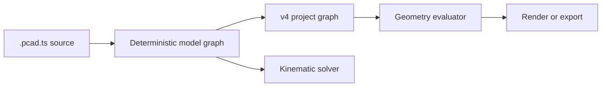

# TypeScript model source

PuppyCAD's code-first model layer treats a `.pcad.ts` module as the editable model. The module default-exports the result of `defineModel()` (a named `model` export is also accepted). It does not serialize arbitrary JavaScript functions into a project file.



The current compiler supports planar outlines extruded along Z because that is the geometry implemented by the existing PuppyCAD evaluator. Component transforms are flattened into those outlines during compilation. The generated project contains a part document for each body and one assembly document containing instances, frame connectors, mates, joint limits, and servo actuators.

## Graph concepts

- A **component instance** creates a hierarchical namespace and a planar transform.
- A **body** contains a closed 2D outline and extrusion depth.
- A **frame** is a named attachment coordinate, optionally owned by a body.
- A **fixed mate** rigidly associates two frames.
- A **revolute mate** associates two frames around an axis and can carry angular limits.
- A **servo** drives one revolute mate and declares its command range, home position, torque, and speed.

References returned by the builder are typed, while persisted references use stable ids. An instance named `index` under a model named `hand` therefore produces ids such as `hand/index/proximal`, `hand/index/mcp`, and `hand/index/drive`.

## Reusable components

`component()` is a typed factory. Calling `scope.instance()` evaluates the factory in a child namespace, applies the instance transform, and returns whatever typed references the component exposes.

```ts
const finger = component<FingerProps, FingerRefs>("Finger", (scope, props) => {
  const proximal = scope.body("proximal", { /* outline and depth */ })
  const base = scope.frame("base", { body: proximal, at: v2(0, 0) })
  return { base }
})

const index = hand.instance("index", finger, indexProps, {
  translate: v2(-23, 31),
  rotateDeg: 5
})
```

The three-finger example uses this pattern for two fingers and an opposable thumb. The source declares 48 visual bodies, 39 frames, 12 revolute mates, 6 fixed mates, and 3 servo actuators.

## Compiled assemblies

Each DSL body becomes both a part document and an assembly instance with the same stable id. Body-attached frames become assembly connectors. Fixed DSL mates compile to `fasten` mates, while revolute mates preserve their axis and limits. Servo declarations become assembly actuators referencing those mate ids.

Frames without a body use `instanceId: null`, which represents a connector in the assembly's world frame. This permits a future solver to express grounding and world constraints without manufacturing a dummy part.

Assembly data survives `.pcad` serialization and normalization. It can be inspected directly:

```sh
puppycad query assemblies model.pcad.ts --json
puppycad query assemblies build/model.pcad --json
```

## CLI workflow

Read-only commands accept TypeScript model sources directly:

```sh
puppycad inspect model.pcad.ts
puppycad query bodies model.pcad.ts --json
puppycad query assemblies model.pcad.ts --json
puppycad graph model.pcad.ts --mermaid
puppycad eval model.pcad.ts --explain
puppycad render model.pcad.ts --out preview.png
```

Compile when another consumer needs a v4 `.pcad` snapshot. The snapshot contains the compiled assembly; the optional graph output also exposes the source-level component hierarchy:

```sh
puppycad model compile model.pcad.ts \
  --out build/model.pcad \
  --graph build/model.graph.json
```

CLI CAD mutation commands intentionally reject `.pcad.ts` sources. Edit the TypeScript source, or compile it and mutate the generated `.pcad` file if a one-off snapshot is desired.

## Simulation boundary

The DSL records the information a simulation needs, but this first version does not solve closed kinematic loops or dynamics. A solver should consume the model graph, produce a pose (joint values plus body transforms), and pass posed geometry to the existing renderer. Geometry compilation and simulation should remain separate consumers of the same graph rather than two competing model formats.
